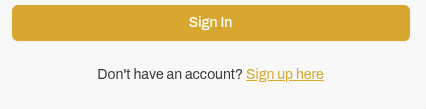
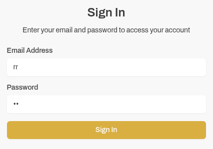
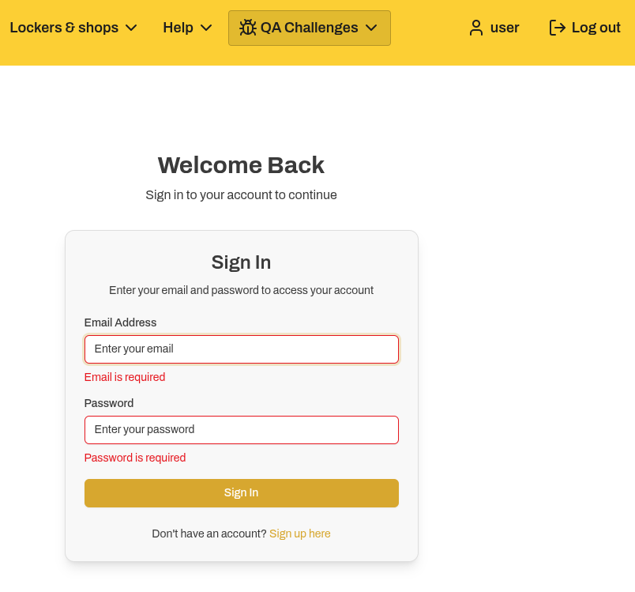

# Website Manual QA Test Report 

## Home page (/)

**[Low]**  
Landing text font weight is inconsistent
The hero text "Your Door To More", the "MORE" word displays inconsistent font thickness,
causing visible UI inconsistency in the landing section.

---

**[Medium]**  
Dropdown submenus provide no feedback on click.
The submenu items under:
- Your Parcels
- Lockers & Shops
- Help

Users cannot determine whether the elements are functional.

---

**[Medium]**  
Navigation Call To Action buttons appear non-functional
The following buttons:
- Track a Parcel
- Return in Seconds
- Send a Parcel

Do not trigger any visible action or user feedback when clicked.
The interface provides no indication that the interaction was registered or not.

---

**[Medium]**  
Newsletter email validation is improperly implemented
The newsletter subscription field accepts invalid email formats
without enforcing standard email validation rules.

---
**[Low]**  
After subscribing to the newsletter, the email address used for the subscription is not displayed.

---
**[Low]**  
Missing punctuation in newsletter consent text
The consent statement:

>"By giving us your email address, you are agreeing to hear about InPost promotions, offers and other services we think will interest you"

is missing a terminating full stop.

---

## Login page (/login)

**[High]**  
Sign Up link is non-functional.
Clicking the Sign Up link does not perform any action and no
feedback or error message is displayed to the user.

---

**[High]**  
The login form has no email validation rules implemented. As long as the field is not empty, it triggers the login functionality, and no feedback is provided regarding user existence (e.g., incorrect email/password or non-existent user).

---

**[Medium]**  
Authenticated user is able to manually access the /login page
instead of being redirected to an authenticated area of the application.

---

**[Medium]**  
Logging out redirects the user to the home page instead of keeping them on the login page.

---

