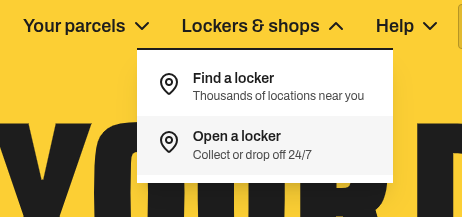
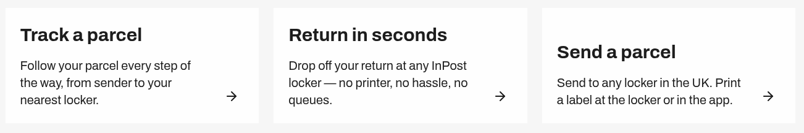
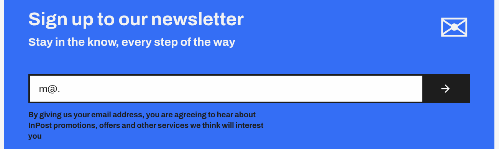

# Test Report — Website QA

## Home page (/)

**[Low]**  
Landing text font weight is inconsistent
The hero text "Your Door To More", the "MORE" word displays inconsistent font thickness,
causing visible UI inconsistency in the landing section.

---

**[Medium]**  
Dropdown submenus provide no feedback on click.
The submenu items under:
- Your Parcels
- Lockers & Shops
- Help

Users cannot determine whether the elements are functional.

---

**[High]**  
Navigation Call To Action buttons appear non-functional
The following buttons:
- Track a Parcel
- Return in Seconds
- Send a Parcel

Do not trigger any visible action or user feedback when clicked.
The interface provides no indication that the interaction was registered or not.

---

**[Medium]**  
Newsletter email validation is improperly implemented
The newsletter subscription field accepts invalid email formats
without enforcing standard email validation rules.

---
**[Low]**  
After subscribing to the newsletter, the email address used for the subscription is not displayed.

---
**[Low]**  
Missing punctuation in newsletter consent text
The consent statement:

>"By giving us your email address, you are agreeing to hear about InPost promotions, offers and other services we think will interest you"

is missing a terminating full stop.

---